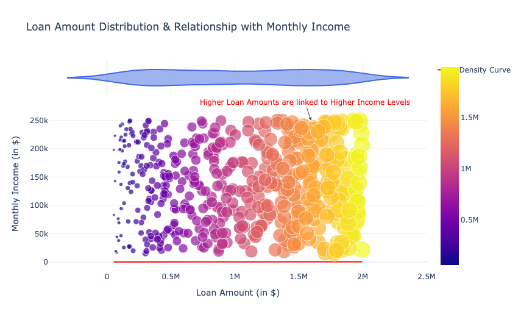
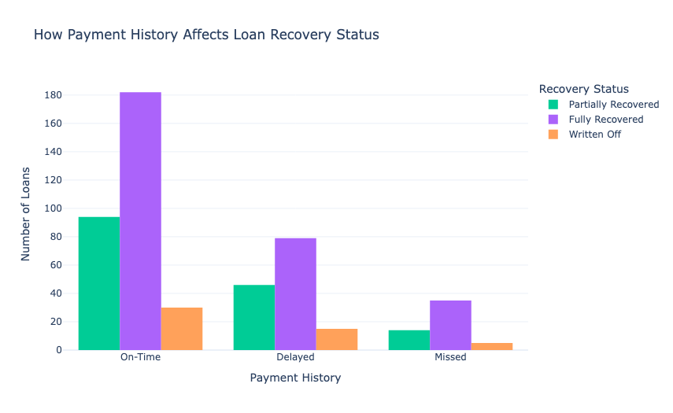
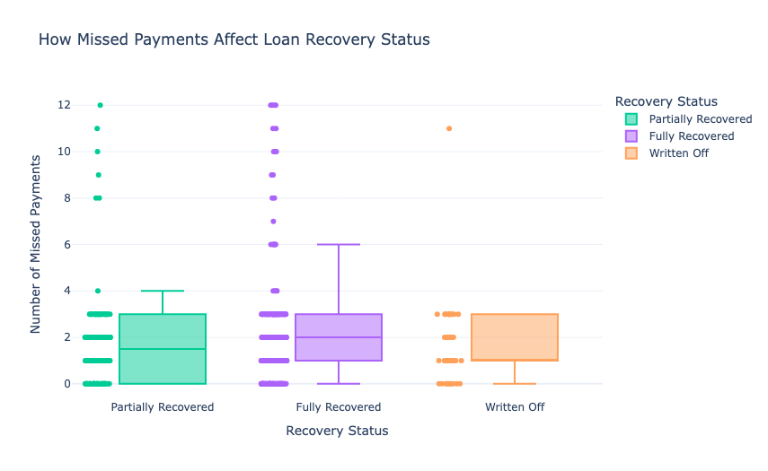

# Smart-Loan-Recovery-System-with-Machine-Learning
Loan defaults pose a significant challenge for financial institutions by affecting profitability and cash flow. Using historical loan repayment data, borrower profiles, and payment behaviours, many financial companies now use a smart loan recovery system to optimize collection efforts, minimize recovery costs, and maximize loan repayments. In this projec, we build a smart loan recovery system with Machine Learning.

# Smart Loan Recovery System: Dataset Overview
To build a loan recovery system with Machine Learning, we will use a dataset containing borrower profiles, loan details, and repayment histories. This dataset includes critical attributes such as:

Demographic Information: Age, employment type, income level, and number of dependents.Loan Details: Loan amount, tenure, interest rate, and collateral value.
Repayment History: Number of missed payments, days past due, and monthly EMI payments.Collection Efforts: Collection methods used, number of recovery attempts, and legal actions taken.Loan Recovery Status: Whether the loan was fully recovered, partially recovered, or remains outstanding.

## Loan Amount Distribution and Relationships with Monthly Income 

The graph demonstrates a positive relationship between loan amounts and monthly income, indicating that individuals with higher income levels tend to secure larger loans. The density curve at the top shows the distribution of loan amounts, emphasizing that higher loan amounts are more frequent among higher income brackets.

It highlights the proportionality between income and loan size, which shows an income-based approach in loan approvals or customer profiling.

# Analyzing Payment History

##Loans with on-time payments are mostly fully recovered. Delayed payments result in a mix of partial and full recoveries, with some written off. Missed payments have a significantly lower recovery rate, with most loans ending up either partially recovered or written off.

# How Missed Payments Affects Loan Recovery Status  

Loans with partial recovery typically have up to 4 missed payments. Fully recovered loans tend to have fewer missed payments, mostly between 0 and 2. Written-off loans show a higher range of missed payments, with several exceeding 6. A higher number of missed payments significantly reduces the likelihood of full recovery and increases the chances of loans being written off.

